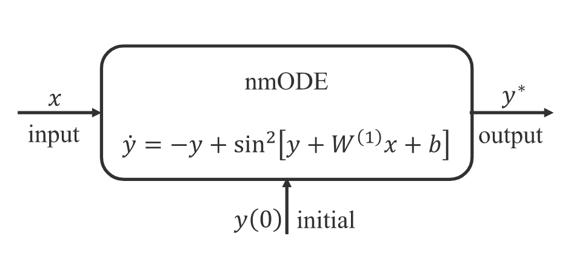
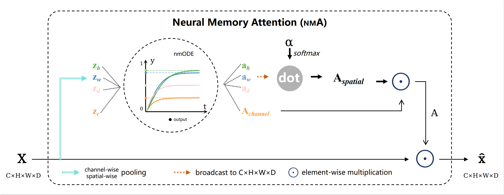

# BMDNeXt

BMDNeXt is a deep learning model for accurate bone mineral density (BMD) prediction from 3D CT scans.

## Model Architecture

BMDNeXt incorporates several key components:

### Neural Memory ODE (nmODE)



nmODE models the dynamics of attention mechanisms in the network.

### Neural Memory Attention (NMA)



NMA uses nmODE to dynamically focus on salient spatial and channel features. It's designed to be plug-and-play, easily insertable into any 3D network, and can be simply modified for 2D feature maps.

### BMDNeXt

The main model architecture includes:
- Multiple stages of 3D convolutional blocks
- Neural Memory Attention modules
- Multi-Scale Adaptive Feature Distribution Smoothing (MS-AFDS)

## Key Features

1. **MS-AFDS**: Addresses feature distribution skewness
2. **MS-ALDS**: Tackles label distribution imbalance

## Usage

### Implementing MS-AFDS

1. Import the module:
   ```python
   from fds import MS_AFDS
   ```

2. Configure in your model:
   ```python
   self.AFDS = MS_AFDS(feature_dim=feature_dim, bucket_num=100, start_update=start_fds_epoch, start_smooth=start_fds_epoch+1)
   ```

3. Apply in forward pass:
   ```python
   if self.training and epoch >= self.start_fds_epoch+1:
       feature = self.AFDS.smooth(feature, labels, epoch)
   ```

4. Update statistics during training:
   ```python
   if epoch >= model.start_fds_epoch:
       model.AFDS.update_last_epoch_stats(epoch)
       model.AFDS.update_running_stats(all_features, all_labels, epoch)
   ```

### Implementing MS-ALDS

1. Import the function:
   ```python
   from lds import ms_alds
   ```

2. Compute adaptive weights:
   ```python
   _, _, adaptive_weights = ms_alds(labels, min_val=0, max_val=1, num_bins=25)
   ```

3. Use in loss calculation:
   ```python
   loss = criterion(outputs, labels, adaptive_weights)
   ```

For detailed implementation, refer to the source code in this repository.

## Custom Dataset Implementation

To use this project with your own dataset, you need to implement a custom dataset class. Here's a general guide:

1. Create a new file, e.g., `custom_dataset.py`.

2. Implement your dataset class:

   ```python
   import torch
   from torch.utils.data import Dataset
   import numpy as np

   class CustomDataset(Dataset):
       def __init__(self, data_path, mode='train'):
           self.data_path = data_path
           self.mode = mode
           self.data, self.labels, self.id = self.load_data()

       def load_data(self):
           # Implement your data loading logic here
           # This should return your data, labels, and patient IDs
           pass

       def __len__(self):
           return len(self.data)

       def __getitem__(self, idx):
           data = torch.from_numpy(self.data[idx]).float()
           label = torch.tensor(self.labels[idx]).float()
           return data, label

       @property
       def id(self):
           return self._id
   ```

3. In the `load_data` method, implement your data loading logic. This should:
   - Load your CT scans (3D volumes)
   - Load corresponding labels
   - Load patient IDs (for cross-validation grouping)

4. In `main.py`, replace the `VertebraeDataset` import with your custom dataset:

   ```python
   from custom_dataset import CustomDataset

   # Replace this line
   dataset = VertebraeDataset('./data', mode='all')
   # with
   dataset = CustomDataset('./data', mode='all')
   ```

5. Run the main script:

   ```bash
   python main.py --datapath ./data --batch_size 24 --lr 0.0001 --epoch 150 --model_name BMDNeXt --seed 4396 --start_epoch 0 --start_fds_epoch 4
   ```

   Adjust the parameters as needed. The script will perform 5-fold cross-validation and output the average MAE and PCC.


